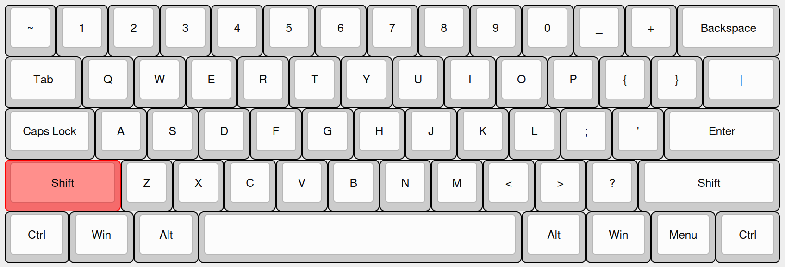
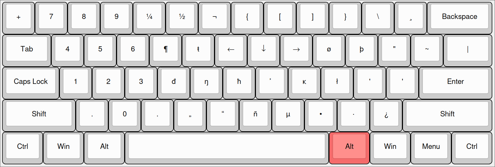

# This is my keyboard layout repo.

## Layout

I used [this](http://www.keyboard-layout-editor.com) website with the 60% preset to create the layout images, you can paste the "Raw Data" in the website to see the layout.

### Base Layer


<details>

  <summary>Raw Data</summary>

  ```
[{a:7},"`","!","@","#","$","%","^","&","*","(",")","-","=",{w:2},"Backspace"],
[{w:1.5},"Tab","q","w","e","r","t","y","u","i","o","p","[","]",{w:1.5},""],
[{w:1.75},"Caps Lock","a","s","d","f","g","h","j","k","l",":","\"",{w:2.25},"Enter"],
[{w:2.25},"Shift","z","x","c","v","b","n","m",",",".","/",{w:2.75},"Shift"],
[{w:1.25},"Ctrl",{w:1.25},"Win",{w:1.25},"Alt",{w:6.25},"",{w:1.25},"Alt",{w:1.25},"Win",{w:1.25},"Menu",{w:1.25},"Ctrl"]
  ```
</details>

### Shift Layer



<details>

  <summary> Raw data</summary>

  ```
[{a:7},"~","1","2","3","4","5","6","7","8","9","0","_","+",{w:2},"Backspace"],
[{w:1.5},"Tab","Q","W","E","R","T","Y","U","I","O","P","{","}",{w:1.5},"|"],
[{w:1.75},"Caps Lock","A","S","D","F","G","H","J","K","L",";","'",{w:2.25},"Enter"],
[{c:"#f56b6b",w:2.25},"Shift",{c:"#cccccc"},"Z","X","C","V","B","N","M","<",">","?",{w:2.75},"Shift"],
[{w:1.25},"Ctrl",{w:1.25},"Win",{w:1.25},"Alt",{w:6.25},"",{w:1.25},"Alt",{w:1.25},"Win",{w:1.25},"Menu",{w:1.25},"Ctrl"]
  ```
</details>


### RAlt Layer



<details>
  <summary>Raw Data</summary>

  ```
[{a:7},"+","¹","@","³","¼","½","¬","{","[","]","}","\\","¸",{w:2},"Backspace"],
[{w:1.5},"Tab","@","ſ","€","¶","ŧ","←","↓","→","ø","þ","\"","~",{w:1.5},"|"],
[{w:1.75},"Caps Lock","æ","ß","ð","đ","ŋ","ħ","̉̉","ĸ","ł","'","'",{w:2.25},"Enter"],
[{w:2.25},"Shift","«","»","¢","„","“","ñ","µ","•","·","̣",{w:2.75},"Shift"],
[{w:1.25},"Ctrl",{w:1.25},"Win",{w:1.25},"Alt",{w:6.25},"",{c:"#f56b6b",w:1.25},"Alt",{c:"#cccccc",w:1.25},"Win",{w:1.25},"Menu",{w:1.25},"Ctrl"]
```
</details>

## Add the layout to your system

### Linux

I use Hyprland, a Wayland based Tiling Window Manager, I think if you use Xorg this process should be easier, you can check [ThePrimeagen's layout](https://github.com/ThePrimeagen/keyboards/tree/master/ubuntu) for how to do it in Ubuntu.

1. Copy the layout file to `/usr/share/X11/xkb/symbols/`

```bash
sudo cp linux/moras-programmer-kb /usr/share/X11/xkb/symbols/
```

2. Add the layout in `/usr/share/X11/xkb/rules/evdev.xml`

```bash
sudo nvim /usr/share/X11/xkb/rules/evdev.xml
```

(Below `<layoutList>`)

```xml
    <layout>
      <configItem>
        <name>moras-programmer-keyboard</name>
        <!-- Keyboard indicator for Moras layout -->
        <shortDescription>mo</shortDescription>
        <description>English (Mora)</description>
        <countryList>
          <iso3166Id>US</iso3166Id>
          <iso3166Id>MX</iso3166Id>
        </countryList>
        <languageList>
          <iso639Id>eng</iso639Id>
          <iso639Id>spa</iso639Id>
        </languageList>
      </configItem>
    </layout>
```

3. Add the layout in your hyprland config

```
input {
  xkb_layout "moras-programmer-keyboard"
}
```

Or you can add it alongside the US layout

```
input {
  xkb_layout "moras-programmer-keyboard, us"
  kb_options "grp:alt_space_toggle"
}
```

**Note:** The `grp:alt_space_toggle` option is to switch between the layouts with `Alt + Space`.

4. Reboot

This should be it 

#### Resources

- [ThePrimeagen's layout](https://github.com/ThePrimeagen/keyboards/tree/master/ubuntu)
- [staticf0x's blog post](https://staticf0x.github.io/2021/custom-keyboard-layout-in-x11-and-wayland.html)
- [stingok's blog post](https://blog.stigok.com/2020/10/27/from-x11-xmodmap-to-wayland-xkb-custom-keyboard-layout.html)
